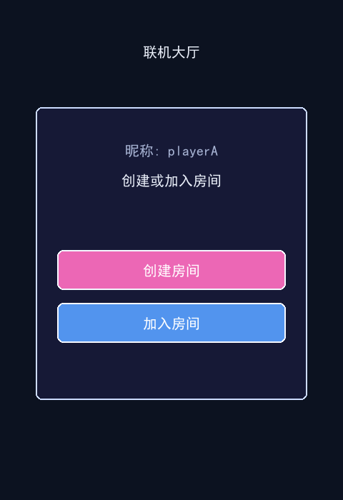
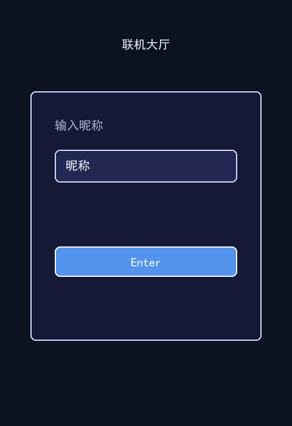
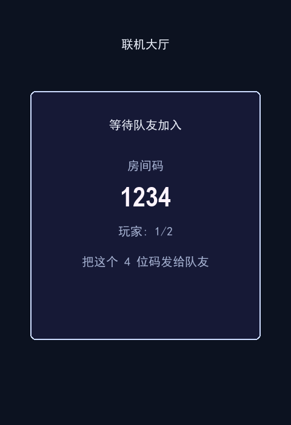
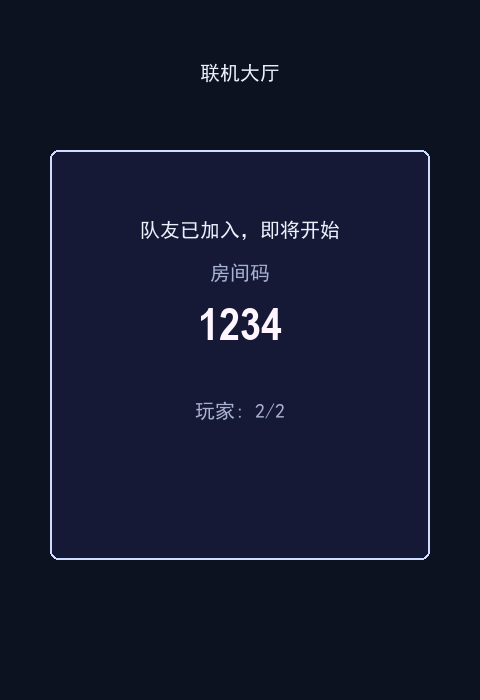

# Airplane Fight 飞机大战

Airplane Fight 是一个基于 Python 的飞机射击游戏项目，包含本地 Pygame 客户端、Flask 后端、Socket.IO 联机同步、房间大厅、排行榜和 MySQL 数据持久化。



## 功能概览

### 1. 本地飞机大战玩法

- 玩家控制飞机移动、射击、躲避敌机和弹幕。
- 支持敌机生成、碰撞检测、击毁计分、生命值和游戏结束流程。
- 包含 Boss、道具、宝石、护盾、回血、升级等游戏元素。
- 使用项目内置图片和音效资源，启动时会优先加载 `code/assets` 下的素材。


### 2. 联机大厅

- 玩家可以输入昵称进入大厅。
- 支持创建房间、加入房间、等待另一名玩家。
- 双方准备后进入联机游戏。







### 3. 后端接口与实时同步

后端使用 Flask + Flask-SocketIO 提供 HTTP 接口和实时事件：

```text
GET  /api/health
POST /api/login
GET  /api/rankings
GET  /api/rooms
POST /api/rooms
POST /api/rooms/<room_id>/join
POST /api/rooms/<room_id>/ready
POST /api/rooms/<room_id>/leave
```

Socket.IO 事件：

```text
client -> server:
join_room
player_ready
leave_room
input
pause_game
restart_game

server -> client:
room_update
game_start
game_state
error
```

### 4. 数据持久化

- MySQL 保存玩家昵称、登录 token、排行榜分数和房间历史。
- 实时房间状态保存在服务端内存中，游戏结算后写入数据库。
- 数据库表结构在 `backend/schema.sql` 中维护。

## 技术栈

- Python 3.10+
- Pygame
- Flask
- Flask-SocketIO
- PyMySQL
- MySQL 8.x

## 本地部署

### 1. 克隆项目

```bash
git clone https://github.com/tomjerry-tech/airplan-fight.git
cd airplan-fight
```

### 2. 创建并激活虚拟环境

Windows PowerShell：

```powershell
python -m venv .venv
.\.venv\Scripts\Activate.ps1
```

Windows CMD：

```bat
python -m venv .venv
.venv\Scripts\activate
```

### 3. 安装依赖

```bash
pip install -r backend/requirements.txt
```

### 4. 准备 MySQL

确认本机已经启动 MySQL，然后配置数据库连接环境变量。

Windows CMD：

```bat
set AIRPLANE_DB_HOST=127.0.0.1
set AIRPLANE_DB_PORT=3306
set AIRPLANE_DB_USER=root
set AIRPLANE_DB_PASSWORD=你的数据库密码
set AIRPLANE_DB_NAME=airplane_game
```

Windows PowerShell：

```powershell
$env:AIRPLANE_DB_HOST="127.0.0.1"
$env:AIRPLANE_DB_PORT="3306"
$env:AIRPLANE_DB_USER="root"
$env:AIRPLANE_DB_PASSWORD="你的数据库密码"
$env:AIRPLANE_DB_NAME="airplane_game"
```

不要把真实数据库密码写进代码或提交到 GitHub。

### 5. 初始化数据库

```bash
python backend/db.py
```

执行成功后会自动创建 `airplane_game` 数据库和所需表。

## 启动方式

### 启动后端

```bash
python backend/app.py
```

默认监听：

```text
http://127.0.0.1:5000
```

可以用下面的接口检查后端是否启动：

```text
http://127.0.0.1:5000/api/health
```

### 启动单机游戏

```bash
python code/main_menu.py
```

或者在 Windows 下双击：

```text
run_game_menu.bat
```

### 启动联机客户端

打开两个终端窗口，分别运行：

```bash
python code/online_game.py --name playerA --create
python code/online_game.py --name playerB --room 房间号
```

也可以不带参数启动，进入大厅后输入昵称、创建房间或加入房间：

```bash
python code/online_game.py
```

### 一键启动联机演示

确认 MySQL 已启动，并且当前终端已经配置 `AIRPLANE_DB_PASSWORD` 后运行：

```bash
python start_dev.py
```

Windows 下也可以双击：

```text
启动联机游戏.bat
```

脚本会启动后端、创建一个测试房间，并打开两个已自动加入房间的客户端窗口。

## 常见问题

### 1. `Access denied for user 'root'@'localhost'`

数据库密码没有配置或配置错误。请重新设置：

```bat
set AIRPLANE_DB_PASSWORD=你的数据库密码
```

PowerShell 使用：

```powershell
$env:AIRPLANE_DB_PASSWORD="你的数据库密码"
```

### 2. `ModuleNotFoundError`

依赖没有安装到当前 Python 环境。重新激活虚拟环境后执行：

```bash
pip install -r backend/requirements.txt
```

### 3. 端口 5000 被占用

关闭旧的 Flask 后端窗口，或者结束占用 5000 端口的进程后重新启动。

## 项目结构

```text
backend/              Flask 后端、数据库、房间、排行榜和测试
code/                 Pygame 客户端、联机客户端和游戏逻辑
code/assets/images/   游戏图片素材
code/assets/sounds/   游戏音效素材
design/               大厅界面截图
start_dev.py          一键启动联机演示脚本
run_game_menu.bat     Windows 单机启动脚本
run_online.bat        Windows 联机演示启动脚本
```

## 提交安全说明

本项目不应提交真实数据库密码、API key、token、私钥、`.env` 文件、IDE 配置、运行日志或 Python 缓存。仓库中的 `.gitignore` 已默认排除这些本地文件。
